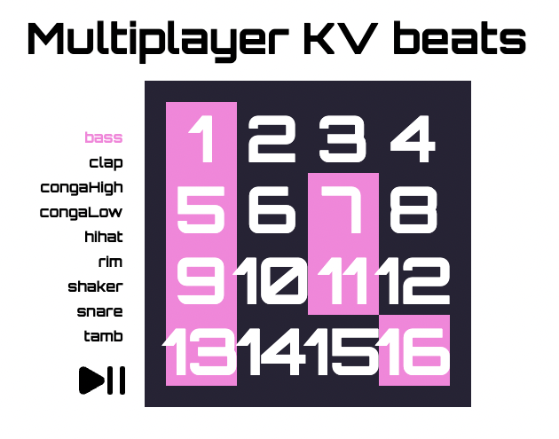

# Deno KV Beats

A simple, multiplayer beat machine that is powered by Deno's KV store. Every 3 seconds the most recent changes from anyone who is interacting with the app are applied.

Created for the [Deno KV Hackathon](https://deno.com/blog/deno-kv-hackathon) (although I submitted it late, so the project wasn't considered).

Find me on [Twitter](https://twitter.com/kevinbatdorf)

